<table class="project-info"> <tbody> <tr> <th>프로젝트명</th> <td>SSAGDA Web Shopping Mall Design</td> </tr>

  <tr>
    <th>서비스 의미</th>
    <td>“싹 다”를 영문 브랜드명으로 표현한 종합 판매 사이트</td>
  </tr>

  <tr>
    <th>팀명 / 팀원</th>
    <td>[SSAGDA] / [이승훈, 이미영, 이현영, 김수민, 이충훈]</td>
  </tr>

</tbody>

</table>

<h2>1. 프로젝트 개요</h2>

<table class="project-overview"> <tbody> <tr> <th>서비스 한 줄 소개</th> <td>패션, 잡화, 리빙, 뷰티, 디지털, 식품 등 생활에 필요한 상품을 한곳에서 탐색하고 구매하는 종합 쇼핑몰</td> </tr>

  <tr>
    <th>핵심 사용자</th>
    <td>여러 카테고리 상품을 한 번에 비교하고 빠르게 구매하려는 온라인 쇼핑 사용자</td>
  </tr>

  <tr>
    <th>핵심 가치</th>
    <td>다양한 상품을 “싹 다” 제공하는 편리함, 명확한 정보 구조, 빠른 구매 흐름</td>
  </tr>

  <tr>
    <th>디자인 방향</th>
    <td>깔끔한 화이트 배경, 오렌지 포인트, 넓은 여백, 둥근 카드, 일관된 상단 헤더</td>
  </tr>

  <tr>
    <th>사용 도구</th>
    <td>DALL·E(AI 기반 초기 UI 시안 생성), PowerPoint/Figma(AI 결과물의 텍스트·배치·UI 요소 후가공), Figma(컴포넌트·스타일 통일 및 프로토타입 연결), React/CSS(실제 화면 구현 및 공통 UI 재사용)</td>
  </tr>
</tbody>

</table>

<h2>2. 핵심 설계 근거 및 평가 피드백 반영</h2>

<h3>2-1. 핵심 사용자 플로우 선정 이유</h3>

본 프로젝트의 핵심 사용자 목표는 <strong>“원하는 상품을 빠르게 탐색·비교하고 구매까지 완료하는 것”</strong>으로 정의하였다. 따라서 쇼핑몰의 여러 기능 중 구매 전환에 직접 연결되는 최소 동선을 핵심 플로우로 선정하였다.

<strong>핵심 플로우: 메인 → 상품 목록 → 상품 상세 → 장바구니 → 주문서 작성</strong>

<table>
<tr><th>단계</th><th>선정 이유</th></tr>
<tr><td>메인</td><td>사용자가 카테고리와 추천 상품을 통해 탐색을 시작하는 진입점이기 때문</td></tr>
<tr><td>상품 목록</td><td>여러 상품을 비교하면서 원하는 상품 후보를 좁히는 핵심 탐색 단계이기 때문</td></tr>
<tr><td>상품 상세</td><td>가격·옵션·상품 정보·리뷰 등을 확인하여 구매 여부를 결정하는 단계이기 때문</td></tr>
<tr><td>장바구니</td><td>구매 후보 상품의 수량·가격·할인 정보를 최종 확인하고 주문 대상으로 확정하는 단계이기 때문</td></tr>
<tr><td>주문서 작성</td><td>배송지와 결제 정보를 입력하여 구매 목적을 완료하는 마지막 단계이기 때문</td></tr>
</table>

로그인, 찜, 이벤트, 고객센터는 중요 기능이지만 구매 과정의 필수 단계는 아니므로 <strong>보조 플로우</strong>로 분리하였다. 이렇게 구성하면 핵심 사용자가 상품을 찾고 구매까지 이어지는 최소 동선을 명확하게 검증할 수 있다.

<h3>2-2. AI 결과물 후가공 방식 선택 이유</h3>

AI 이미지 생성은 초기 아이디어를 빠르게 시각화하는 데 유리하지만, 실제 UI 화면에서는 텍스트 깨짐, 버튼·아이콘 위치 오차, 화면별 여백 차이, 동일 요소의 형태 변화가 발생할 수 있다. 따라서 AI 결과물을 최종 산출물로 그대로 사용하지 않고 <strong>PowerPoint와 Figma를 이용해 후가공</strong>하였다.

<table>
<tr><th>도구</th><th>선택 이유</th></tr>
<tr><td>PowerPoint</td><td>AI 시안 위에서 텍스트 교체, 도형·아이콘 추가, 빠른 배치 수정과 수정 전/후 비교가 쉬워 초기 보정 작업에 적합함</td></tr>
<tr><td>Figma</td><td>텍스트·버튼·카드·아이콘을 독립 UI 요소로 재구성할 수 있고, 정렬·간격·오토레이아웃·컴포넌트·스타일을 사용하여 여러 화면을 동일한 규칙으로 수정하기 쉬움</td></tr>
<tr><td>React/CSS</td><td>공통 헤더·푸터·로고 등의 UI를 재사용하고 공통 스타일을 적용할 수 있어 실제 웹 화면에서도 화면 간 일관성을 유지하기 적합함</td></tr>
</table>

즉, AI는 <strong>“초기 시각화와 아이디어 확장”</strong>에 사용하고, Figma/PowerPoint/React는 <strong>“정확한 UI 구성과 일관성 보정”</strong>에 사용하여 생성형 AI의 장점과 디자인 도구의 편집성을 결합하였다.

<h3>2-3. AI 생성 한계 진단 및 재발 방지 프롬프트 전략</h3>

AI 이미지 생성 과정에서 확인한 대표적인 한계는 다음과 같다.

<table>
<tr><th>발생 가능한 한계</th><th>원인 및 문제</th><th>재발 방지 전략</th></tr>
<tr><td>텍스트 왜곡·깨짐</td><td>AI 이미지 모델이 한글 UI 문구를 이미지 요소로 생성하면서 글자 형태가 틀어질 수 있음</td><td>이미지 생성 단계에서는 긴 문장을 최소화하고, 정확한 문구는 Figma에서 실제 텍스트 레이어로 교체함</td></tr>
<tr><td>버튼·아이콘 중복 또는 누락</td><td>요소 수와 위치를 모호하게 요청하면 AI가 임의로 UI 요소를 추가·삭제할 수 있음</td><td>“상단 헤더 1개, 주요 CTA 버튼 1개, 카드 4개”처럼 요소의 종류와 개수를 명시함</td></tr>
<tr><td>화면 구조 불일치</td><td>화면마다 독립적으로 생성하면 헤더 높이, 카드 반경, 여백, 정렬 방식이 달라질 수 있음</td><td>기준 화면을 먼저 정한 뒤 “기존 헤더·색상·카드 스타일·여백을 그대로 유지”라는 제약 조건을 반복해서 포함함</td></tr>
<tr><td>오브젝트 형태 오류</td><td>아이콘, 상품 이미지, UI 오브젝트가 비정상적으로 합쳐지거나 비율이 달라질 수 있음</td><td>장식 요소보다 기능 중심의 단순한 UI로 요청하고, 필요한 오브젝트는 후가공 단계에서 별도 아이콘·도형으로 교체함</td></tr>
</table>

<strong>프롬프트 작성 원칙</strong>

1. 화면 목적을 먼저 명시: “상품 상세 페이지”, “장바구니 페이지”처럼 역할을 먼저 지정한다.  
2. 유지할 요소를 고정: “기존 상단 헤더, 오렌지 브랜드 포인트, 카드 스타일, 여백을 유지”라고 명시한다.  
3. 변경할 요소만 구체적으로 작성: “하단에 상세정보/리뷰/추천상품/Q&amp;A 탭만 추가”처럼 수정 범위를 제한한다.  
4. 요소 수와 위치를 명확히 작성: 버튼 수, 카드 수, 정렬 방향, 상·하단 위치를 구체적으로 지정한다.  
5. 생성 후 검수 항목을 정해 반복 보정: 텍스트, 정렬, 아이콘, 화면 구조, 브랜드 색상 순서로 확인한 뒤 필요한 부분만 재생성 또는 후가공한다.

<strong>예시 프롬프트</strong>

> 기존 SSAGDA 상품 상세 화면의 상단 헤더, 오렌지 포인트 색상, 카드 모양과 전체 여백은 그대로 유지한다. 첫 화면의 구성은 변경하지 않는다. 하단 스크롤 영역에 상세정보, 리뷰, 추천상품, Q&amp;A의 4개 탭만 추가한다. 버튼의 크기와 간격은 동일하게 정렬하고 새로운 메뉴나 장식 요소는 임의로 추가하지 않는다. 텍스트는 짧은 UI 라벨 중심으로 구성하며 세부 문구는 후가공 단계에서 교체할 수 있도록 단순하게 표현한다.

<h3>2-4. 화면 간 일관성 유지 전략과 기술적 이유</h3>

여러 화면을 각각 제작하더라도 사용자가 하나의 쇼핑몰을 이용한다고 느끼도록 다음 규칙을 공통 적용하였다.

<table>
<tr><th>일관성 항목</th><th>적용 전략</th><th>기술적 이유</th></tr>
<tr><td>헤더·내비게이션</td><td>모든 화면에서 동일한 로고 위치, 메뉴 구조, 검색/찜/장바구니/마이 영역을 유지</td><td>공통 컴포넌트로 관리하면 한 곳의 수정이 여러 화면에 동일하게 반영되어 화면별 차이를 줄일 수 있음</td></tr>
<tr><td>색상</td><td>화이트 중심 배경과 SSAGDA 오렌지 포인트를 기준 색상으로 사용</td><td>공통 색상 스타일 또는 CSS 변수로 관리하면 화면마다 0다른 임의 색상이 적용되는 것을 방지할 수 있음</td></tr>
<tr><td>타이포그래피</td><td>제목, 본문, 보조 설명, 버튼의 글자 크기와 굵기 규칙을 통일</td><td>텍스트 스타일을 재사용하면 정보 위계가 동일하게 유지되어 가독성이 높아짐</td></tr>
<tr><td>간격·정렬</td><td>카드 내부 여백, 섹션 간 간격, 버튼 높이와 정렬 기준을 동일하게 적용</td><td>Figma 오토레이아웃과 공통 CSS 규칙을 사용하면 화면이 추가되어도 같은 간격 체계를 유지할 수 있음</td></tr>
<tr><td>카드·버튼 형태</td><td>둥근 모서리, 동일한 카드 구조, 주요 버튼과 보조 버튼의 시각적 우선순위를 통일</td><td>컴포넌트화하면 반복 요소의 크기·모양·상태를 동일하게 유지할 수 있어 수정 누락을 줄일 수 있음</td></tr>
</table>

이와 같이 <strong>Figma에서는 컴포넌트·스타일·오토레이아웃</strong>을 이용하고, 실제 웹 구현에서는 <strong>공통 React 컴포넌트와 공통 CSS</strong>를 재사용하여 디자인 단계와 구현 단계 모두에서 화면 간 일관성을 유지하도록 설계하였다.

<h2>3. 최종 화면 구성</h2>

<table class="screen-table"> <thead> <tr> <th>No.</th> <th>화면</th> <th>주요 구성</th> </tr> </thead>

<tbody>
  <tr>
    <td>1</td>
    <td>메인 페이지</td>
    <td>브랜드 배너, 카테고리, 추천 상품, 특가 영역</td>
  </tr>

  <tr>
    <td>2</td>
    <td>상품 목록</td>
    <td>필터, 정렬, 상품 카드 그리드</td>
  </tr>

  <tr>
    <td>3</td>
    <td>상품 상세</td>
    <td>상품 이미지, 가격, 옵션, 구매 버튼, 상품 정보</td>
  </tr>

  <tr>
    <td>4</td>
    <td>장바구니</td>
    <td>선택 상품, 수량, 쿠폰, 결제 예정 금액</td>
  </tr>

  <tr>
    <td>5</td>
    <td>주문서 작성</td>
    <td>배송지, 요청사항, 결제 수단, 주문 요약</td>
  </tr>

  <tr>
    <td>6</td>
    <td>로그인</td>
    <td>이메일 로그인, 소셜 로그인, 회원가입 이동</td>
  </tr>

  <tr>
    <td>7</td>
    <td>마이페이지</td>
    <td>주문 상태, 쿠폰, 포인트, 최근 주문</td>
  </tr>

  <tr>
    <td>8</td>
    <td>찜한 상품</td>
    <td>관심 상품 목록, 카테고리 필터, 장바구니 담기</td>
  </tr>

  <tr>
    <td>9</td>
    <td>이벤트</td>
    <td>쿠폰팩, 할인 이벤트, 리뷰 적립 이벤트</td>
  </tr>

  <tr>
    <td>10</td>
    <td>고객센터</td>
    <td>FAQ 검색, 문의 카테고리, 자주 묻는 질문</td>
  </tr>
</tbody>

</table>

---

# 피그마 주소
https://www.figma.com/design/Ji8cqNFdc97doPus3qjwr1/-Project-A--AI-%EA%B8%B0%EB%B0%98-UI-UX-%EB%94%94%EC%9E%90%EC%9D%B8-%EC%8B%9C%EC%95%88-%EC%A0%9C%EC%9E%91?node-id=10-7&t=fkbS8GPpapVK3Di1-1

---

# 깃허브 액션
https://birdcross.github.io/ssagda/
---

# png 파일은  
/src/assets/고객센터.png
/src/assets/홈.png
/src/assets/카테고리.png
/src/assets/이벤트.png
/src/assets/로그인.png
/src/assets/장바구니.png
/src/assets/주문서작성.png
/src/assets/패션.png
/src/assets/디지털.png
/src/assets/선물.png
/src/assets/찜.png
모든 PNG 파일은 /src/assets/ 포함하여 이미지를 대체함
---

## 1. 프롬프트 최적화 로그 – 고객센터

### 수정전 / 수정후

<table>
<tr>
<th width="50%">수정전</th>
<th width="50%">수정후</th>
</tr>

<tr>
<td align="center">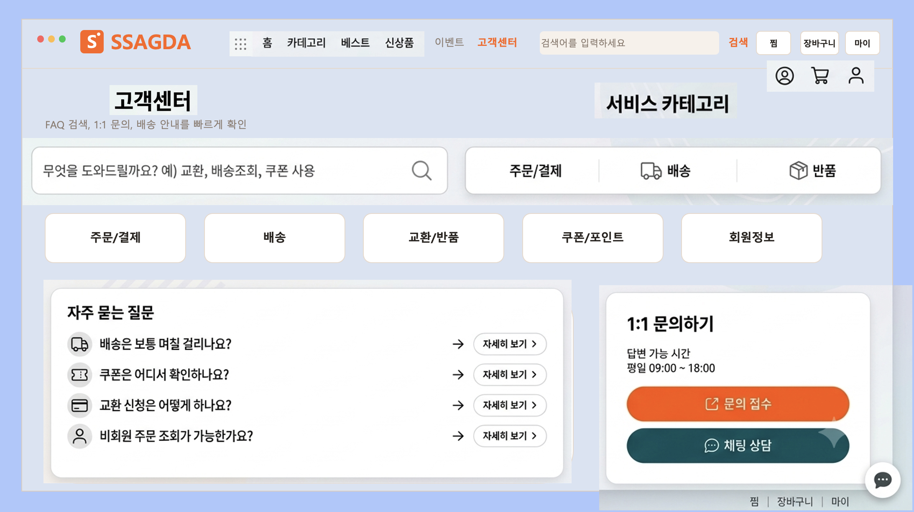</td>
<td align="center">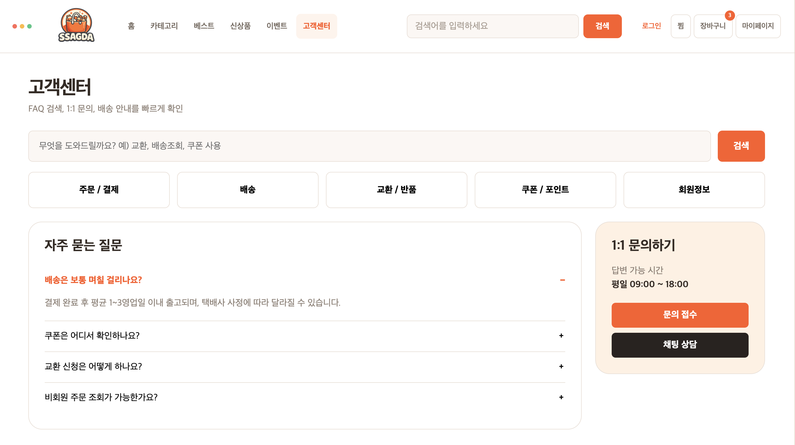</td>
</tr>
</table>

### 표 내용 정리

<table>
<tr>
<th>단계</th>
<th>프롬프트</th>
<th>결과 및 문제점</th>
<th>개선 판단</th>
</tr>
<tr>
<td>초안</td>
<td>쇼핑 웹사이트용 고객센터 화면</td>
<td>
파워포인트 슬라이드가 단순한 도형 그리기 기능과 글자만으로 구성이 돼있고, 아이콘 등 시각적인 부분이 없어 세련되지 못함.  
로고 색상과 배경 색상이 같음.  
전체 기능 보기가 없음.  
고객센터 글자가 다른 항목 글자와 같아서 찾기 힘들.  
검색 항목이 하나로 나와 있음.
</td>
<td>
고객센터 화면이 시각적으로 세련되지 못함.  
로고 색상과 배경 색상을 서로 대비되게 변경.  
전체 기능 보기 추가.  
고객센터 글자를 다른 항목 글자와 달리 빨간색으로 해서 찾기 쉽도록 변경.  
찜, 장바구니, 톱 아이콘 추가.  
검색 항목을 고객센터와 서비스 카테고리로 세분화.
</td>
</tr>
<tr>
<td>수정 1</td>
<td>
고객센터 페이지 링크 글자, 찜, 장바구니, 마이페이지, 검색 부분,  
(자주 쓰는 주문/결제, 배송, 반품을 포함해서) 서비스 카테고리 항목 추가  
자주 묻는 질문 세부 항목 옆에 아이콘 추가  
문의 접수, 채팅 상담
</td>
<td>
페이지가 시각적으로 보기 좋게 변경됨.(내용 옆에 아이콘 추가)  
배경 색상이 로고 색상과 대비되게 바뀜.
</td>
<td>(빈 칸)</td>
</tr>
<tr>
<td>최종</td>
<td>(빈 칸)</td>
<td>(빈 칸)</td>
<td>(빈 칸)</td>
</tr>
</table>

---

## 2. 작업 로그

### 수정전 / 수정후

<table>
<tr>
<th width="50%">수정전</th>
<th width="50%">수정후</th>
</tr>
<tr>
<td align="center">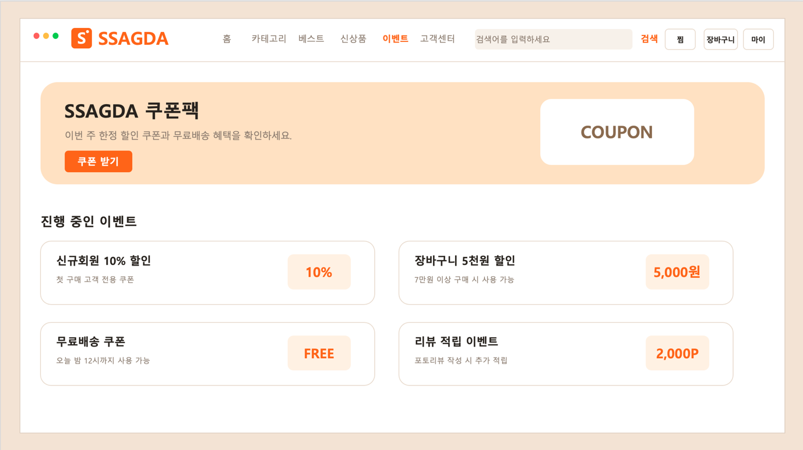</td>
<td align="center">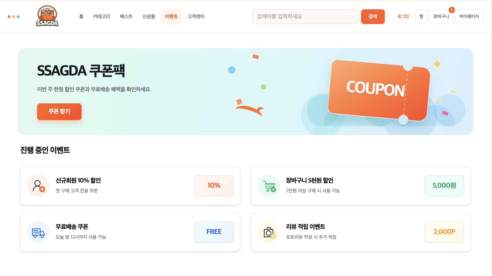</td>
</tr>
</table>

### 표 내용 정리

<table>
<tr>
<th>단계</th>
<th>프롬프트</th>
<th>결과 및 개선점</th>
</tr>
<tr>
<td>초안</td>
<td>SSAGDA 쿠폰팩 페이지</td>
<td>베이지·크림 계열의 색감과 넉넉한 여백 덕분에 편안하고 정돈된 느낌이지만, 전체 색상이 비슷하여 다소 얌전하고 평면적으로 보이는 인상도 있습니다. 즉, 포근한 감성은 있지만 생동감은 살짝 부족한 디자인</td>
</tr>
<tr>
<td>수정1</td>
<td>
민트·스카이블루 그라데이션 적용  
입체적인 오렌지 쿠폰 그래픽 추가  
이벤트별 직관적인 아이콘 배치  
카드 여백과 글자 대비 개선  
기존 메뉴·혜택·문구는 그대로 유지
</td>
<td>
결과: 
쿠폰과 혜택별 버튼에 색상을 적용하여 정보 구분이 쉬워졌으며, 밝은 배경과 색상 대비로 화면이 명쾌하고 생동감 있게 개선되었습니다. 주요 혜택과 클릭 요소도 이전보다 빠르게 인식됩니다.  
개선점: 
여러 색상이 사용된 만큼 전체 색상의 채도와 톤을 조금 더 통일하고, 핵심 쿠폰과 보조 혜택 사이의 크기·색상 차이를 명확히 하면 시선의 흐름이 더욱 자연스러워질 것입니다. 또한 작은 글자의 크기와 버튼 간 여백을 조정하면 가독성과 완성도를 한층 높일 수 있습니다.
</td>
</tr>
<tr>
<td>최종</td>
<td>
혜택 버튼에 아래와 같은 색상 적용  
10% : 코랄 
5,000원: 민트 
FREE: 스카이블루 
2,000P: 버터 옐로
</td>
<td>각 아이콘 색상과 자연스럽게 연결돼 정보 구분이 빨라졌고, 화면도 한층 생기 있어졌습니다. 딱 과하지 않은 '산뜻함 한 스푼'</td>
</tr>
</table>

### 최종 산출물

프로젝트명: SSAGDA 쿠폰팩 페이지

화면 1: 따뜻하고 차분한 분위기이지만 색상 대비가 약해 다소 평면적으로 보임

화면 2: 민트·코랄 색상으로 산뜻하고 생동감 있게 개선되어 주요 혜택이 잘 드러남

화면 3: 하단 버튼까지 부드러운 포인트 색상을 적용하여 정보 구분과 전체적인 디자인 완성도가 높아짐

---

## 3. 작업 로그

### 수정전 / 수정후

<table>
<tr>
<th width="50%">수정전</th>
<th width="50%">수정후</th>
</tr>
<tr>
<td align="center">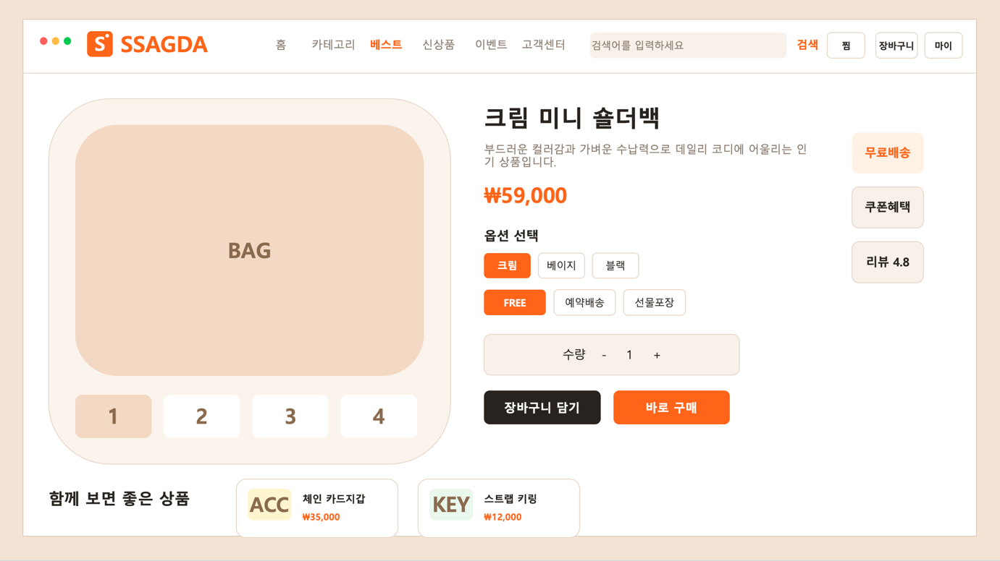</td>
<td align="center">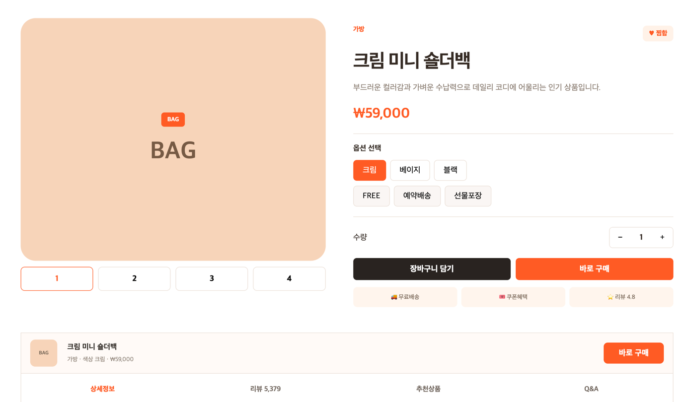</td>
</tr>
</table>

### 추가 화면

<table>
<tr>
<th width="50%">수정후 화면 2</th>
<th width="50%">수정후 화면 3</th>
</tr>
<tr>
<td align="center">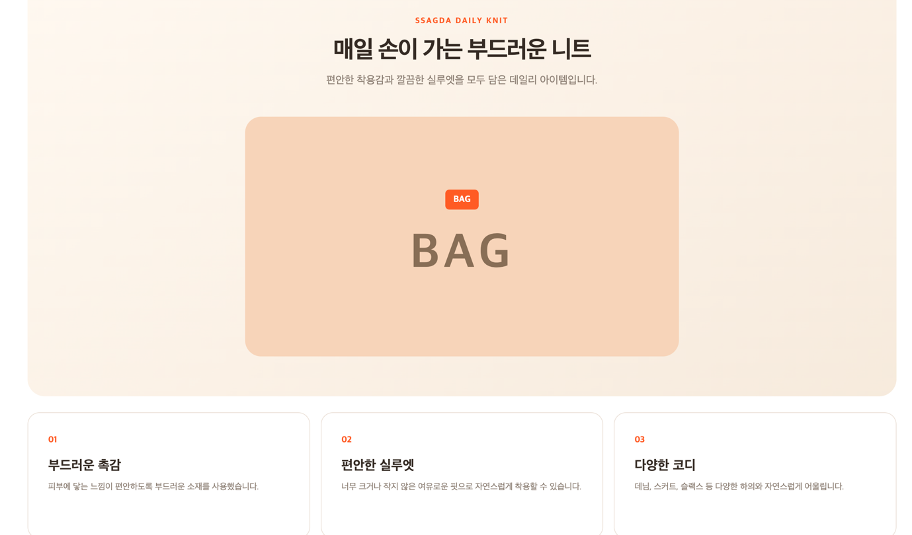</td>
<td align="center">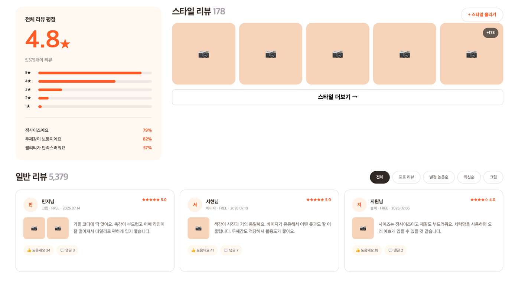</td>
</tr>
<tr>
<th>수정후 화면 4</th>
<th></th>
</tr>
<tr>
<td align="center">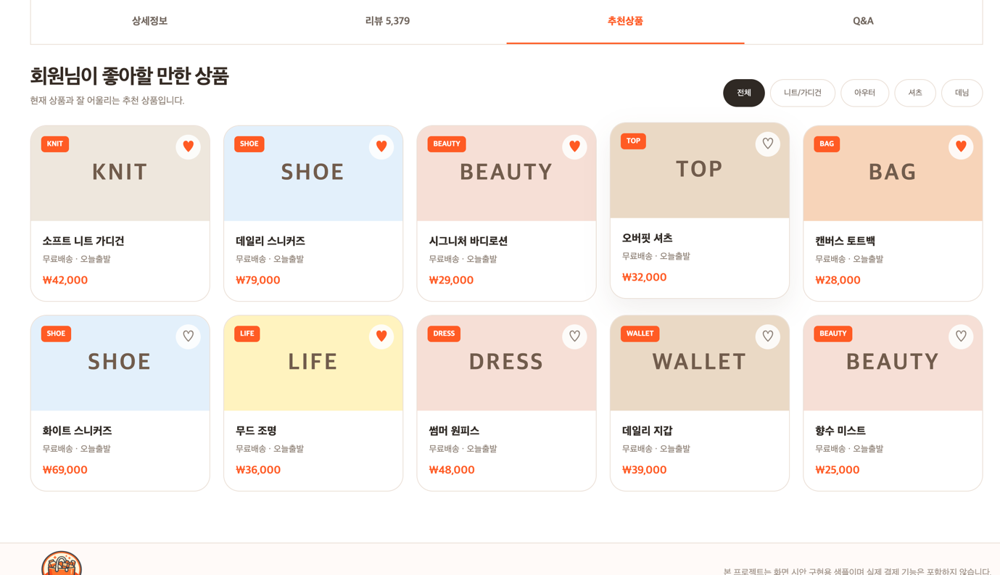</td>
<td></td>
</tr>
</table>

### 표 내용 정리

<table>
<tr>
<th>단계</th>
<th>프롬프트</th>
<th>결과 및 개선점</th>
</tr>
<tr>
<td>수정전</td>
<td>
기존 웹사이트 상품 상세 페이지  
메인 상품 화면 디자인 그대로 유지  
첫 화면은 수정하지 않고 기준 화면으로 사용
</td>
<td>
기존 화면은 상품 이미지, 옵션, 가격, 추천 영역이 한 페이지에 배치된 기본 상세 구조였습니다.  
웜톤 중심의 안정적인 디자인 완성도는 높았지만, 스크롤 이후 상세정보를 단계적으로 탐색할 수 있는 장치가 부족했습니다.  
상세정보·리뷰·추천상품·Q&amp;A가 독립적으로 연결되지 않아 정보 확장성과 사용자 이동 동선에는 한계가 있었습니다.
</td>
</tr>
<tr>
<td>수정후</td>
<td>
수정전 메인 화면은 그대로 유지  
하단 스크롤 구간에 상세정보·리뷰·추천상품·Q&amp;A 버튼 추가  
버튼 클릭 시 각 페이지로 이동하는 탭형 상세 구조 제작  
꼼데1 워드 파일의 기능 구성을 참고해 인터랙션 반영  
디자인 톤은 수정전 화면과 맞춰 일관성 유지
</td>
<td>
결과: 기존 첫 화면을 유지한 상태에서 스크롤 이후 탭형 내비게이션을 추가하여 정보 접근 구조를 확장했습니다.  
상세정보 페이지는 카드형 요약 구성을 사용해 제품 특징을 직관적으로 전달하고, 리뷰 페이지는 평점 분포·스타일 리뷰·일반 리뷰를 분리해 신뢰도와 가독성을 높였습니다.  
추천상품 페이지는 카테고리 필터와 상품 카드 그리드를 적용해 탐색성을 강화했고, Q&amp;A 페이지는 안내 박스와 아코디언형 목록으로 문의 확인 흐름을 단순하게 정리했습니다.  
개선점: “크림 사이트”에서 참고한 기능을 살리되, 전체 색감과 여백은 수정전 디자인을 기준으로 맞춰 화면 전환 시에도 동일한 브랜드 톤이 유지되도록 구성했습니다.
</td>
</tr>
<tr>
<td>최종</td>
<td>
버튼 구성: 상세정보 / 리뷰 / 추천상품 / Q&amp;A  
첫 화면 디자인은 유지하고 하위 콘텐츠만 확장  
기능은 “크림사이트 참고”기준, 디자인은 수정전 기준으로 통일
</td>
<td>
각 버튼이 독립 페이지 역할을 하도록 정리되어 스크롤 이후에도 원하는 정보로 빠르게 이동할 수 있게 되었습니다.  
기존 메인 화면의 분위기를 해치지 않으면서도, 상세 설명·후기·추천 상품·문의 기능이 명확히 분리되어 사용자 경험과 정보 전달력이 함께 향상되었습니다.
</td>
</tr>
</table>

### 최종 산출물

프로젝트명: 상품 상세 페이지 탭 확장형 리디자인

화면 1: 기존 상품 상세 첫 화면은 그대로 유지하여 기존 디자인과 브랜드 분위기를 보존함

화면 2: 하단 탭 버튼을 추가해 상세정보·리뷰·추천상품·Q&A로 빠르게 이동할 수 있는 구조를 만듦

화면 3: 상세정보 페이지는 카드형 설명 구성을 적용해 제품 특징을 더 쉽게 이해할 수 있도록 정리함

화면 4: 리뷰 페이지는 평점 요약, 스타일 리뷰, 일반 리뷰를 분리해 신뢰성과 가독성을 강화함

화면 5: 추천상품과 Q&A 페이지는 탐색 편의성과 문의 확인 기능을 높이면서 전체 디자인 톤을 수정전 화면과 통일함

---

## 4. 작업 로그— 장바구니 페이지

### 수정전 / 수정후

<table>
<tr>
<th width="50%">수정전</th>
<th width="50%">수정후</th>
</tr>
<tr>
<td align="center">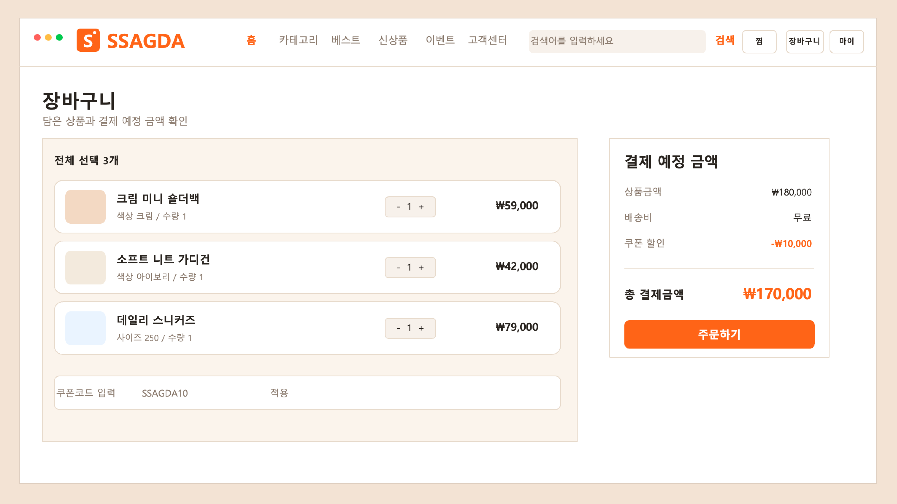</td>
<td align="center">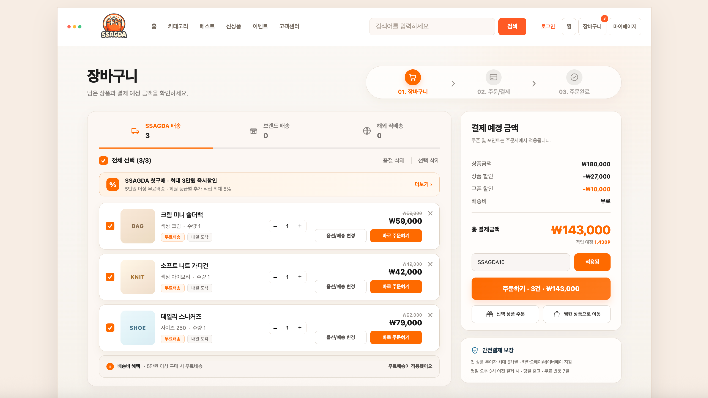</td>
</tr>
</table>

### 표 내용 정리

<table>
<tr>
<th>단계</th>
<th>프롬프트</th>
<th>결과 및 개선점</th>
</tr>
<tr>
<td>초안</td>
<td>
SSAGDA 쇼핑몰 장바구니 페이지  
와이어프레임을 회색조로 간단하게 
구성해줘.  
상품 3개(이름·색상·수량), 수량 조절, 
쿠폰코드 입력창, 상품금액·배송비· 
쿠폰할인·총 결제금액, 주문하기 
버튼만 있으면 됨.
</td>
<td>
결과: 장바구니의 최소 골격(상품 목록·수량· 
쿠폰·총액)은 갖췄지만 로고가 텍스트 아이콘 
수준이고 전체가 흑백 톤이라 브랜드 정체성이 
드러나지 않음.  
문제점: 지금 결제 단계가 몇 번째인지 알 수 
없고, 상품별 할인·배송 정보·삭제 기능이 
전혀 없어 정보량이 부족함.
</td>
</tr>
<tr>
<td>수정1</td>
<td>
SSAGDA 로고(쇼핑백 아이콘)와 오렌지 
브랜드 컬러를 전체 UI에 적용해줘.  
상단에 01 장바구니 → 02 주문/결제 → 
03 주문완료 진행 단계 바를 추가하고, 
SSAGDA배송/브랜드배송/해외직배송 
탭으로 상품군을 구분해줘. 장바구니 
아이콘에 담긴 상품 수 뱃지도 넣어줘.
</td>
<td>
결과: 로고·컬러 통일로 브랜드 느낌이 생기고, 
진행 단계 바 덕분에 사용자가 결제 흐름 중 
현재 위치를 즉시 인지할 수 있게 됨.  
배송 방식별 탭(SSAGDA배송 3 / 브랜드배송 0 / 
해외직배송 0)으로 묶음 배송 상품과 그렇지 
않은 상품이 구분되어 주문 관리가 쉬워짐.
</td>
</tr>
<tr>
<td>수정2</td>
<td>
각 상품 행에 체크박스, 정가(취소선)와 
할인가, '무료배송'·'내일 도착' 뱃지, 
'옵션/배송 변경'·'바로 주문하기' 버튼, 
삭제(X) 아이콘을 추가해줘.  
리스트 상단에는 전체 선택(선택 수/전체 수) 
체크박스와 '품절 삭제·선택 삭제' 링크, 
'SSAGDA 첫구매 최대 3만원 즉시할인' 
프로모션 배너를 넣어줘.
</td>
<td>
결과: 상품별 정가·할인가 비교로 할인 폭이 
직관적으로 보이고, 배송 뱃지·개별 주문 
버튼으로 상품마다 바로 구매할 수 있는 
동선이 생김.  
전체선택/품절삭제 기능과 프로모션 배너로 
다건 관리 편의성과 추가 구매 유도 요소가 
함께 강화됨.
</td>
</tr>
<tr>
<td>최종</td>
<td>
결제 예정 금액에 상품금액·상품 할인· 
쿠폰 할인을 항목별로 분리하고, 총 
결제금액 아래 적립 예정 포인트를 
표시해줘. 쿠폰 적용 시 버튼 텍스트를 
'적용됨'으로 바꾸고, 주문 버튼에는 
선택 건수와 결제 금액을 함께 보여줘.  
'선택 상품 주문'·'찜한 상품으로 이동' 
보조 버튼과, 무이자 할부·간편결제· 
반품정책을 안내하는 '안전결제 보장' 
박스를 하단에 추가해줘.
</td>
<td>
결과: 할인 항목이 상품 할인·쿠폰 할인으로 
나뉘어 얼마가 왜 깎였는지 명확해지고, 
적립 포인트 노출로 결제 후 혜택까지 
한눈에 파악됨.  
'주문하기 · 3건 · ₩143,000'처럼 버튼에 
핵심 정보를 담아 결제 직전 확인 절차를 
줄였고, 안전결제 보장 박스가 결제 
이탈을 막는 심리적 안전장치 역할을 함.
</td>
</tr>
</table>
### 최종 산출물

프로젝트명: SSAGDA 장바구니 페이지

화면 1: 로고·오렌지 브랜드 컬러 적용과 01→02→03 주문 진행 단계 바, 배송 방식별 탭 추가로 결제 흐름 내 현재 위치와 상품 구성을 명확히 인지할 수 있음.

화면 2: 전체선택/품절삭제, 프로모션 배너, 상품별 정가·할인가·배송 뱃지·'바로 주문하기' 버튼 추가로 정보 밀도와 개별 구매 동선이 강화됨.

화면 3: 결제 예정 금액을 상품 할인·쿠폰 할인으로 분리하고 적립 포인트를 표시, 주문 버튼에 건수·금액을 함께 노출해 결제 직전 확인 절차를 줄임.

화면 4: '선택 상품 주문'·'찜한 상품으로 이동' 보조 버튼과 안전결제 보장 박스(무이자 할부·간편결제·반품정책)를 추가해 결제 신뢰도와 이탈 방지를 함께 높임.

  <h2>8. Figma 프로토타입 구성 계획</h2>

  <table class="prototype-table">
    <thead>
      <tr>
        <th>출발 화면</th>
        <th>클릭 영역</th>
        <th>도착 화면</th>
        <th>전환 목적</th>
      </tr>
    </thead>

<tbody>
  <tr>
    <td>메인 페이지</td>
    <td>상단 카테고리 / 전체보기</td>
    <td>상품 목록</td>
    <td>카테고리별 상품 탐색</td>
  </tr>

  <tr>
    <td>메인 페이지</td>
    <td>추천 상품 카드</td>
    <td>상품 상세</td>
    <td>선택 상품 정보 확인</td>
  </tr>

  <tr>
    <td>상품 목록</td>
    <td>상품 카드</td>
    <td>상품 상세</td>
    <td>상품 옵션 및 가격 확인</td>
  </tr>

  <tr>
    <td>상품 상세</td>
    <td>장바구니 담기</td>
    <td>장바구니</td>
    <td>구매 후보 상품 확인</td>
  </tr>

  <tr>
    <td>장바구니</td>
    <td>주문하기</td>
    <td>주문서 작성</td>
    <td>배송지·결제 정보 입력</td>
  </tr>

  <tr>
    <td>상단 헤더</td>
    <td>로그인 / 마이</td>
    <td>로그인 또는 마이페이지</td>
    <td>회원 기능 접근</td>
  </tr>

  <tr>
    <td>상단 헤더</td>
    <td>찜 아이콘</td>
    <td>찜한 상품</td>
    <td>관심 상품 확인</td>
  </tr>

  <tr>
    <td>상단 메뉴</td>
    <td>이벤트</td>
    <td>이벤트</td>
    <td>쿠폰·혜택 확인</td>
  </tr>

  <tr>
    <td>고객지원 링크</td>
    <td>고객센터</td>
    <td>고객센터</td>
    <td>FAQ 및 문의 정보 확인</td>
  </tr>
</tbody>
  </table>

  <h3>프로토타입 연결 순서</h3>

  

    <h4>Main User Flow</h4>

  메인 → 상품 목록 → 상품 상세 → 장바구니 → 주문서 작성

  메인 → 로그인 → 마이페이지

  메인 → 찜한 상품 / 이벤트 / 고객센터

<h4>핵심 플로우 선정 근거</h4>

  메인 → 상품 목록 → 상품 상세 → 장바구니 → 주문서 작성 흐름은 사용자의 핵심 목표인 “상품 탐색 → 비교·판단 → 구매 완료”를 가장 짧고 직접적으로 검증할 수 있는 경로이므로 Main User Flow로 선정하였다. 로그인, 찜, 이벤트, 고객센터는 구매를 보조하는 기능이므로 별도의 Sub Flow로 구성하였다.

 

---
